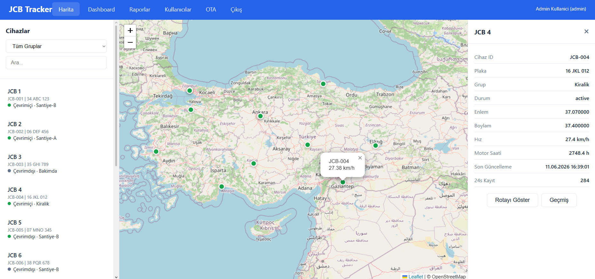

<p align="center">
  
  
  
  
</p>

<h1 align="center">JCB Tracker</h1>

<p align="center">
  <b>İş Makineleri için Profesyonel Takip Sistemi</b><br>
  <i>Çok kiracılı, satılmaya hazır, turn-key IoT takip platformu</i>
</p>

<p align="center">
  <a href="#-amaç">Amaç</a> •
  <a href="#-hızlı-başlangıç">Hızlı Başlangıç</a> •
  <a href="#-kullanım">Kullanım</a> •
  <a href="#-özellikler">Özellikler</a> •
  <a href="#english">English</a>
</p>

<br>



<br>

---

## 🎯 Amaç

**JCB Tracker**, iş makineleri (JCB, kamyon, otobüs, iş makinesi) için geliştirilmiş, **çok kiracılı (multi-tenant)** bir GPS takip platformudur.

> **Kimler için?** Filo sahipleri, iş makinesi kiralama firmaları, lojistik şirketleri.

> **Nasıl çalışır?** Her müşteri kendi sunucusuna kurar, ESP32 donanımını makinelerine bağlar, web panelden tüm filoyu yönetir.

**Öne çıkan özellik:** Satılmaya hazır — kendi markanızla müşterilerinize filo takip hizmeti satabilirsiniz.

---

## 🚀 Hızlı Başlangıç

### ☁️ Kurulum (Linux VPS — Tek Komut)

Yeni bir Ubuntu/Debian sunucuya SSH yapın ve şu komutu çalıştırın:

```bash
curl -sSL https://raw.githubusercontent.com/azerenes/JCB-Takip/main/scripts/setup.sh | bash
```

Script sizden domain adı ve e-posta ister, ardından:

- Docker kurulumu (yoksa)
- Projeyi `/opt/jcb-tracker`'a indirir
- SSL sertifikası (Let's Encrypt) ile HTTPS kurar
- Tüm servisleri başlatır

> Tek yapmanız gereken: bir domaini VPS IP'nize yönlendirmek ve scripti çalıştırmak.

### 💻 Yerel Geliştirme (Docker)

```bash
git clone https://github.com/azerenes/JCB-Takip.git
cd JCB-Takip
docker compose up -d --build
# http://localhost:3000
```

---

## 📖 Kullanım

1. **Setup Sihirbazı** — İlk kurulumda lisans, admin hesabı ve firma bilgileri girilir
2. **Dashboard** — Canlı harita, cihaz durumu, uyarılar, istatistik kartları
3. **Cihazlar** — Cihaz ekleme, düzenleme, konum geçmişi, OTA güncelleme
4. **Uyarılar** — Hız aşımı, geofence ihlali, düşük batarya, kontak dışı çalışma
5. **ELD** — Sürücü çalışma kayıtları (saat, mesafe, yakıt)
6. **Raporlar** — PDF ve CSV formatında detaylı raporlar
7. **Super Admin** — Tenant yönetimi, lisans üretme, sistem istatistikleri

| Varsayılan Hesap | Email | Şifre |
|-----------------|-------|-------|
| Süper Admin | `admin@jcbtracker.com` | `admin123` |

---

## ✨ Özellikler

| Özellik | Açıklama |
|---------|----------|
| 🛰️ **GPS Takip** | Anlık konum, hız, rota kaydı, geçmiş oynatma |
| 🗺️ **Canlı Harita** | Leaflet.js ile renk kodlu marker'lar, 15sn güncelleme |
| 🏢 **Multi-Tenant** | Her müşteri kendi verilerini görür, tam izolasyon |
| ⚡ **Uyarı Motoru** | Hız, geofence, mesai dışı, düşük batarya, akü |
| 📋 **Raporlar** | PDF ve CSV export, özelleştirilebilir raporlar |
| 📱 **ELD** | Sürücü çalışma saatleri ve mesafe kaydı |
| 🔧 **Firmware Builder** | ESP32 için JSON config + şablonlar |
| 🔄 **OTA** | Kablosuz firmware güncelleme |
| ⚙️ **Yönetim** | Kullanıcı, cihaz, geofence, bildirim ayarları |
| 🎨 **White-label** | Kendi logonuz, renkleriniz, firma adınız |

---

## 🛠️ Teknolojiler

| Bileşen | Teknoloji |
|---------|-----------|
| Backend | Node.js, Express, Mongoose |
| Veritabanı | MongoDB 7.0 |
| MQTT | EMQX 5.3 |
| WebSocket | Socket.IO |
| Ön Yüz | HTML, CSS, Leaflet.js, Chart.js |
| Donanım | ESP32, GPS NEO-6M, 4G/LTE SIM7600, CAN-Bus MCP2515 |
| PlatformIO | C++ firmware |

---

## 📦 Kurulum Detayları

Tüm servisler Docker ile çalışır:

```
docker compose up -d
```

Detaylı kurulum, donanım bağlantı şemaları ve ESP32 firmware derleme talimatları:
- [`docs/architecture.md`](docs/architecture.md) — Mimari
- [`docs/deployment.md`](docs/deployment.md) — Dağıtım
- [`docs/protocol.md`](docs/protocol.md) — MQTT protokolü
- [`hardware/wiring_diagram.md`](hardware/wiring_diagram.md) — Donanım bağlantıları

---

<h2 id="english">English</h2>

<p align="center">
  <b>JCB Tracker</b> — Professional Fleet Tracking for Heavy Machinery
</p>

A turn-key, multi-tenant IoT tracking platform designed for construction equipment, trucks, buses, and industrial vehicles. Each customer deploys on their own server with full data isolation.

### Quick Start

**One-command deployment (Ubuntu/Debian VPS):**
```bash
curl -sSL https://raw.githubusercontent.com/azerenes/JCB-Takip/main/scripts/setup.sh | bash
```

**Local development:**
```bash
git clone https://github.com/azerenes/JCB-Takip.git
cd JCB-Takip
docker compose up -d --build
# Open http://localhost:3000
```

The **Setup Wizard** guides you through license activation, admin account creation, and company branding on first run.

### Features
- Real-time GPS tracking with Leaflet map
- Multi-tenant architecture (each customer isolated)
- Alert engine (speed, geofence, battery, ignition)
- ELD driver logs, PDF/CSV reports
- ESP32 firmware with OTA updates
- White-label ready (your logo, colors, brand)

### Tech
*Node.js + Express + MongoDB + EMQX + Socket.IO + Leaflet.js + ESP32*

---

<p align="center">
  <i>JCB Tracker v2.0.0 — Professional IoT Fleet Tracking Platform</i>
</p>
